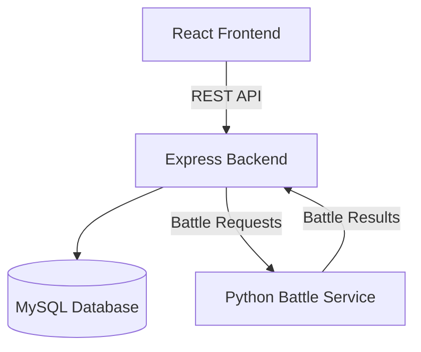

# Pokemon Origins

A full-stack Pokémon application built with **React**, **Express.js**, **MySQL**, and **Python**, featuring a Pokédex, trainer management system, and a turn-based battle simulator.

---

## Table of Contents

- [Features](#features)
- [Architecture](#architecture)
- [Project Structure](#project-structure)
- [Technology Stack](#technology-stack)
- [Getting Started](#getting-started)
- [Environment Variables](#environment-variables)
- [API Endpoints](#api-endpoints)
- [Contributing](#contributing)
- [Acknowledgements](#acknowledgements)

---

## Features

- ✅ User authentication using JWT
- ✅ Browse and search Pokémon
- ✅ View detailed Pokémon information
- ✅ Trainer profile management
- ✅ Turn-based Pokémon battle simulator
- ✅ Python battle engine integrated with Node.js backend
- ✅ MySQL database for persistent storage
- ✅ Responsive React frontend built with Tailwind CSS

---

## Architecture



### Architecture Overview

- The **React frontend** communicates with the **Express backend** through REST APIs.
- The **backend** manages authentication, trainer data, Pokémon data, and database operations.
- Battle requests are forwarded to a dedicated **Python battle service**, which performs battle calculations and returns the results.
- **MySQL** stores user accounts, trainer progress, and Pokémon-related data.

---

## Project Structure

```text
Pokemon-Origins/
│
├── backend/
│   ├── config/
│   ├── database/
│   ├── routes/
│   ├── utils/
│   ├── index.js
│   ├── package.json
│   └── .env
│
├── frontend/
│   ├── public/
│   ├── src/
│   │   ├── components/
│   │   ├── pages/
│   │   ├── App.jsx
│   │   └── main.jsx
│   ├── package.json
│   └── .env
│
├── battle-logic-service/
│   ├── main.py
│   ├── models.py
│   ├── utils.py
│   ├── requirements.txt
│   └── .env
│
├── backup_pokedex_trainer.sql
├── docker-compose.yml
└── README.md
```

---

## Technology Stack

### Frontend

- React 18
- Vite
- Tailwind CSS
- React Router
- Context API

### Backend

- Node.js
- Express.js
- MySQL
- mysql2
- JWT Authentication
- Cookie Parser

### Battle Service

- Python 3
- Custom turn-based battle engine

### Dev Tools

- Docker
- Docker Compose
- Git

---

# Getting Started

## Prerequisites

Make sure you have installed:

- Node.js (v18 or above)
- Python (3.11 or above)
- MySQL 8
- Git

---

## Clone Repository

```bash
git clone https://github.com/your-username/Pokemon-Origins.git

cd Pokemon-Origins
```

---

## Database Setup

Create a database named:

```text
pokedex
```

Import the database dump:

```bash
mysql -u root -p pokedex < backup_pokedex_trainer.sql
```

---

## Backend Setup

```bash
cd backend

npm install

npm run dev
```

Runs on:

```
http://localhost:5000
```

---

## Frontend Setup

```bash
cd frontend

npm install

npm run dev
```

Runs on:

```
http://localhost:5173
```

---

## Battle Logic Service

```bash
cd battle-logic-service

pip install -r requirements.txt

python main.py
```

Runs on:

```
http://localhost:5001
```

---

## Docker (Optional)

Start every service together.

```bash
docker-compose up --build
```

---

# Environment Variables

## Backend (`backend/.env`)

```env
PORT=5000
DB_HOST=localhost
DB_USER=root
DB_PASSWORD=your_password
DB_NAME=pokedex
DB_PORT=3306
CORS_ORIGIN=http://localhost:5173
JWT_SECRET=your_secret_key
```

---

## Frontend (`frontend/.env`)

```env
VITE_API_URL=http://localhost:5000/api
VITE_BATTLE_URL=http://localhost:5001/battle
VITE_APP_NAME=Pokemon Origins
```

---

## Battle Logic Service (`battle-logic-service/.env`)

```env
HOST=0.0.0.0
PORT=5001
BACKEND_URL=http://localhost:5000/api
```

---

# API Endpoints

## Authentication

| Method | Endpoint | Description |
|---------|----------|-------------|
| POST | `/api/register` | Register a new trainer |
| POST | `/api/login` | Login |
| POST | `/api/validate` | Validate JWT |

---

## Pokémon

| Method | Endpoint |
|---------|----------|
| GET | `/api/pokemons` |
| GET | `/api/pokemons/:id` |
| GET | `/api/pokemon-types` |
| GET | `/api/pokemon-moves` |
| GET | `/api/pokemon-abilities` |

---

## Trainer

| Method | Endpoint |
|---------|----------|
| GET | `/api/trainer/:id` |
| PUT | `/api/trainer/:id` |
| GET | `/api/trainer/:id/pokemon` |

---

## Battle

| Method | Endpoint |
|---------|----------|
| POST | `/api/battle/start` |
| POST | `/api/battle/action` |
| GET | `/api/battle/state` |
| POST | `/api/battle/end` |

---

## Screenshots

> Add screenshots here after deployment.

### Home

```
assets/home.png
```

### Pokédex

```
assets/pokedex.png
```

### Battle

```
assets/battle.png
```

### Trainer Profile

```
assets/profile.png
```

---

# Contributing

1. Fork the repository.
2. Create a feature branch.

```bash
git checkout -b feature/new-feature
```

3. Commit your changes.

```bash
git commit -m "Add new feature"
```

4. Push the branch.

```bash
git push origin feature/new-feature
```

5. Open a Pull Request.

---

# Acknowledgements

- Pokémon data provided by **PokéAPI**
- Inspired by the Pokémon game series
- Built using React, Express.js, MySQL, and Python

---

## Author

**Aayushman**

Computer Science Undergraduate • Full Stack Developer • Competitive Programmer
